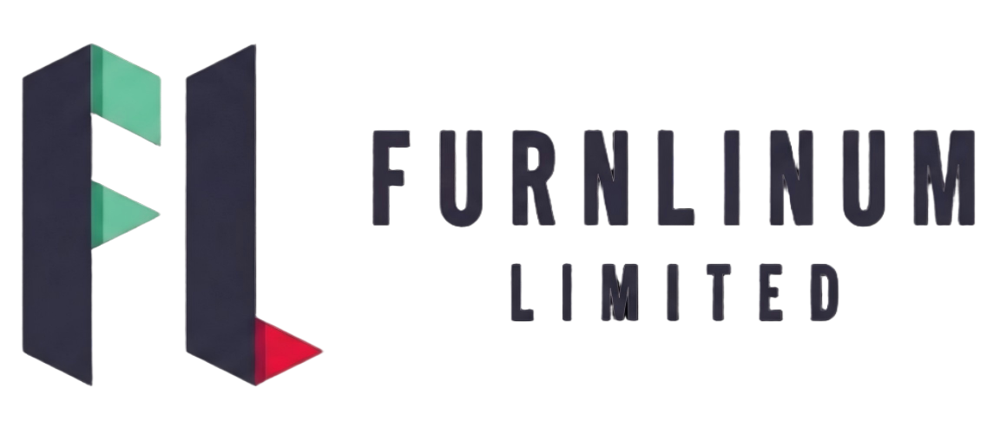

# ManufacturePro 製造業官網模板

一個功能完整、專業的製造業企業官網模板，支持中英文切換，包含輪播Banner、產品展示、新聞資訊等模塊。

## ✨ 功能特點

### 核心功能
- ✅ **輪播Banner** - 3張全屏輪播圖，支持自動播放、手動切換、觸摸滑動
- ✅ **產品展示系統** - 產品列表、產品詳情、分類篩選
- ✅ **新聞資訊系統** - 新聞列表、新聞詳情、分類管理
- ✅ **客戶案例展示** - 行業案例、客戶評價
- ✅ **在線詢價表單** - B2B專業詢價功能
- ✅ **中英文切換** - 完整的國際化支持
- ✅ **響應式設計** - 完美適配PC、平板、手機

### 製造業特色
- 📋 ISO質量認證展示
- 🏭 生產能力數據展示
- 📊 準時交付率等關鍵指標
- 🔧 OEM/ODM定製服務說明
- ⚙️ 技術參數詳細展示
- 📦 MOQ、交貨期等B2B信息

## 📁 項目結構

```
tpl-website-1/
├── index.html              # 首頁（輪播Banner + 產品預覽 + 新聞預覽）
├── products.html           # 產品列表頁（帶篩選）
├── product-detail.html     # 產品詳情頁
├── about.html              # 關於我們頁
├── cases.html              # 客戶案例頁
├── news.html               # 新聞資訊列表
├── news-detail.html        # 新聞詳情頁
├── css/
│   └── style.css          # 全局樣式（含輪播、新聞、響應式）
├── js/
│   ├── i18n.js           # 國際化功能
│   └── main.js           # 主要交互功能（含輪播類）
├── data/
│   └── translations.json  # 中英文翻譯數據
├── images/                # 圖片目錄（待添加真實圖片）
├── index-old.html         # 原首頁備份
└── README.md              # 本文檔
```

## 🚀 快速開始

### 方法一：直接打開
雙擊 `index.html` 文件即可在瀏覽器中查看完整網站

### 方法二：使用本地服務器（推薦）
```bash
# 使用 Python
python -m http.server 8000

# 使用 Node.js
npx http-server

# 使用 PHP
php -S localhost:8000
```

然後訪問：`http://localhost:8000`

## 📄 頁面說明

### 1. 首頁 (index.html)
- **輪播Banner區** - 3張全屏輪播，展示公司核心優勢
- **製造優勢** - 6個核心優勢展示
- **產品展示** - 精選6款產品預覽
- **新聞資訊** - 最新3條新聞動態
- **數據展示** - 關鍵業務數據
- **詢價表單** - 在線詢價功能

### 2. 產品列表 (products.html)
- 12款產品展示
- 分類篩選（智能設備、便攜設備、專業設備）
- 網格佈局
- 查看詳情和獲取報價按鈕

### 3. 產品詳情 (product-detail.html)
- 產品大圖展示
- 技術參數表格
- 產品特點說明
- 應用領域
- 相關產品推薦

### 4. 關於我們 (about.html)
- 公司簡介
- 企業願景、使命、價值觀
- 發展歷程時間線
- 公司優勢
- 團隊介紹

### 5. 客戶案例 (cases.html)
- 6個行業案例展示
- 項目數據詳情
- 客戶評價模塊
- 按行業分類

### 6. 新聞資訊 (news.html)
- 新聞列表（公司新聞、行業動態、技術文章）
- 分類篩選
- 新聞卡片佈局
- 分頁功能

### 7. 新聞詳情 (news-detail.html)
- 新聞標題和元信息
- 正文內容
- 相關新聞推薦

## 🎨 自定義指南

### 更換公司信息

#### 1. 修改公司名稱和Logo
```html
<!-- 在所有HTML文件中查找替換 -->
ManufacturePro → 你的公司名稱
```

**添加Logo圖片：**
1. 將Logo圖片放入 `images/` 目錄，如 `logo.png`
2. 修改所有頁面的導航欄：
```html
<!-- 原來的文字Logo -->
<a href="index.html" class="logo">ManufacturePro</a>

<!-- 改爲圖片Logo -->
<a href="index.html" class="logo">
  
</a>
```

#### 2. 修改聯繫方式
在所有HTML文件中查找並替換：
- 地址：`中國廣東省深圳市寶安區工業園`
- 電話：`+86 755-1234-5678`
- 郵箱：`sales@manufacturepro.com`

#### 3. 修改輪播Banner
編輯 `index.html` 中的Banner內容：
```html
<!-- 修改文字 -->
<h1 data-i18n="banner.slide1Title">你的標題</h1>
<p data-i18n="banner.slide1Desc">你的描述</p>

<!-- 修改背景圖片（在CSS中） -->
```

修改 `css/style.css` 中的背景：
```css
.banner-slide-1 {
  background: linear-gradient(135deg, rgba(37, 99, 235, 0.9) 0%, rgba(30, 64, 175, 0.9) 100%),
              url('../images/banner1.jpg');  /* 添加真實圖片 */
  background-size: cover;
  background-position: center;
}
```

#### 4. 修改產品信息
編輯各頁面中的產品信息，包括：
- 產品名稱
- 產品描述
- 產品圖片（替換emoji）
- 技術參數

**替換產品圖片：**
```html
<!-- 原來的emoji佔位 -->
<div class="product-image">
  <span>🔩</span>
</div>

<!-- 改爲真實圖片 -->
<div class="product-image" style="background-image: url('./images/product1.jpg'); background-size: cover;">
</div>
```

#### 5. 修改顏色主題
編輯 `css/style.css` 中的顏色變量：
```css
:root {
  --primary-color: #2563eb;      /* 主色調 - 改爲你的品牌色 */
  --secondary-color: #1e40af;    /* 輔助色 */
  --text-color: #1f2937;         /* 文字顏色 */
  --text-light: #6b7280;         /* 淺色文字 */
}
```

### 修改翻譯內容
編輯 `data/translations.json`：
```json
{
  "zh": {
    "nav": {
      "home": "首頁",
      "products": "產品中心",
      ...
    }
  },
  "en": {
    "nav": {
      "home": "Home",
      "products": "Products",
      ...
    }
  }
}
```

## 🎯 輪播Banner使用說明

### Banner功能
- **自動播放**：每5秒自動切換
- **手動控制**：點擊左右箭頭切換
- **導航點**：點擊底部圓點跳轉到指定幻燈片
- **鍵盤控制**：使用左右方向鍵切換
- **觸摸滑動**：在移動設備上左右滑動切換
- **懸停暫停**：鼠標懸停時暫停自動播放

### 修改輪播速度
編輯 `js/main.js` 中的 `BannerSlider` 類：
```javascript
startAutoPlay() {
  this.autoPlayInterval = setInterval(() => {
    this.nextSlide();
  }, 5000); // 修改這裏的數字（毫秒）
}
```

### 添加更多幻燈片
在 `index.html` 中添加新的幻燈片：
```html
<!-- 幻燈片 4 -->
<div class="banner-slide banner-slide-4">
  <div class="banner-content">
    <h1>你的標題</h1>
    <p>你的描述</p>
    <div class="banner-buttons">
      <a href="#" class="btn">按鈕</a>
    </div>
  </div>
</div>
```

同時在導航點中添加：
```html
<div class="banner-dots">
  <span class="banner-dot active"></span>
  <span class="banner-dot"></span>
  <span class="banner-dot"></span>
  <span class="banner-dot"></span>  <!-- 新增 -->
</div>
```

在CSS中添加樣式：
```css
.banner-slide-4 {
  background: linear-gradient(...), url('...');
  background-size: cover;
}
```

## 📱 響應式斷點

- **桌面端**：> 768px
- **平板**：≤ 768px
- **手機**：≤ 480px

## 🌐 瀏覽器支持

- Chrome (最新版)
- Firefox (最新版)
- Safari (最新版)
- Edge (最新版)
- 移動端瀏覽器

## 📝 待添加內容清單

### 必須添加
- [ ] 公司真實Logo圖片
- [ ] 產品真實圖片
- [ ] Banner背景圖片
- [ ] 新聞配圖
- [ ] 公司聯繫方式
- [ ] 公司簡介文字

### 建議添加
- [ ] 資質認證證書圖片
- [ ] 生產車間照片
- [ ] 團隊照片
- [ ] 客戶Logo牆
- [ ] 視頻介紹
- [ ] 在線客服功能

## 🔧 技術棧

- **HTML5** - 語義化標籤
- **CSS3** - Flexbox + Grid + 動畫
- **JavaScript (ES6+)** - 原生JS，無依賴
- **響應式設計** - Mobile First

## 📊 性能優化建議

1. **圖片優化**
   - 使用WebP格式
   - 壓縮圖片大小
   - 使用CDN加速

2. **代碼優化**
   - 壓縮CSS和JS文件
   - 合併請求
   - 啓用GZIP壓縮

3. **加載優化**
   - 圖片懶加載
   - 異步加載JS
   - 使用瀏覽器緩存

## 🚢 部署建議

### GitHub Pages
```bash
git init
git add .
git commit -m "Initial commit"
git push -u origin main
```
在倉庫設置中啓用 GitHub Pages

### Vercel / Netlify
直接拖拽項目文件夾或連接Git倉庫

### 傳統服務器
將所有文件上傳到服務器的web目錄即可

## 💡 常見問題

**Q: 如何修改網站標題？**
A: 修改各頁面 `<title>` 標籤中的內容

**Q: 輪播不工作怎麼辦？**
A: 檢查 `js/main.js` 是否正確加載，瀏覽器控制檯是否有錯誤

**Q: 如何添加更多語言？**
A: 在 `translations.json` 中添加新的語言鍵，並在頁面中添加對應的語言切換按鈕

**Q: 移動端菜單不顯示？**
A: 檢查CSS文件是否正確加載，查看響應式媒體查詢是否生效

**Q: 表單提交後數據去哪了？**
A: 當前表單只有前端驗證，需要添加後端API接口來處理表單數據

## 📞 技術支持

如需進一步定製或有技術問題，請提供：
1. 參考網站截圖
2. 公司Logo和產品圖片
3. 具體需求說明

## 📄 許可證

MIT License - 可自由使用、修改和分發

## 🎉 更新日誌

### v1.0.0 (2026-01-12)
- ✅ 完整的7個頁面
- ✅ 輪播Banner功能
- ✅ 新聞資訊系統
- ✅ 客戶案例展示
- ✅ 中英文切換
- ✅ 響應式設計
- ✅ 製造業專業功能

---

**提示**：這是一個模板項目，請根據實際情況修改內容和圖片。建議在正式上線前添加真實的公司信息、產品圖片和聯繫方式。
